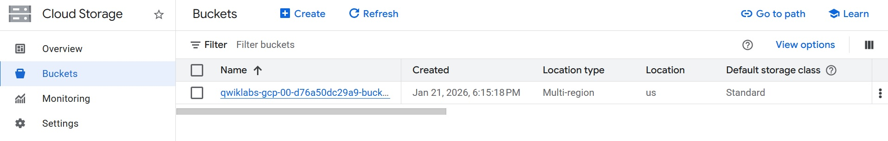
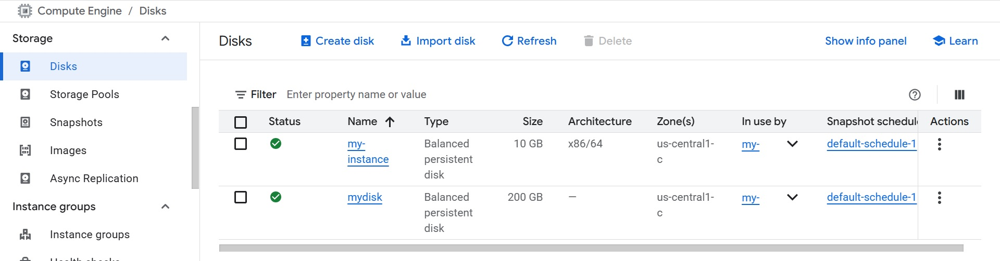
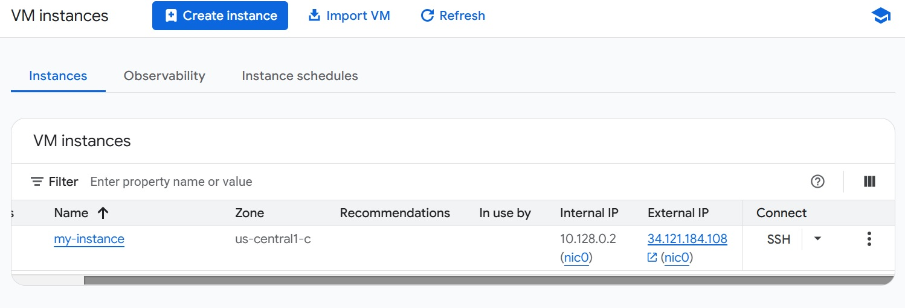
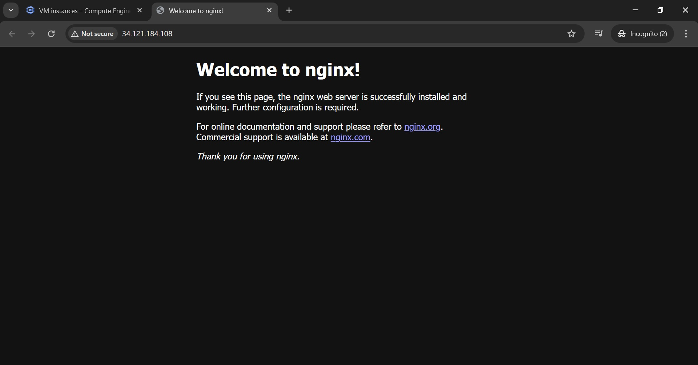

# Google Cloud Skills Boost - Lab Challenge

Repositori ini berisi dokumentasi dan kode infrastruktur untuk latihan Google Cloud Platform.

## Tugas yang Diselesaikan:
1.  **Cloud Storage:** Membuat bucket multi-region di US untuk menyimpan aset.

2.  **Compute Engine:** Membuat VM Instance `e2-medium` dengan sistem operasi Debian 12.
3.  **Persistent Disk:** Membuat dan memasang disk tambahan sebesar 200GB ke VM.

4.  **Web Server:** Instalasi dan konfigurasi NGINX melalui SSH.

## Teknologi yang Digunakan:
* Google Cloud Platform (GCP)
* Linux (Debian 12)
* NGINX Web Server
* Terraform (untuk otomatisasi infrastruktur)
